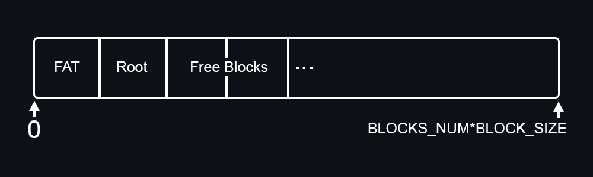
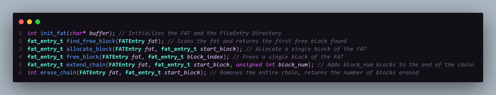
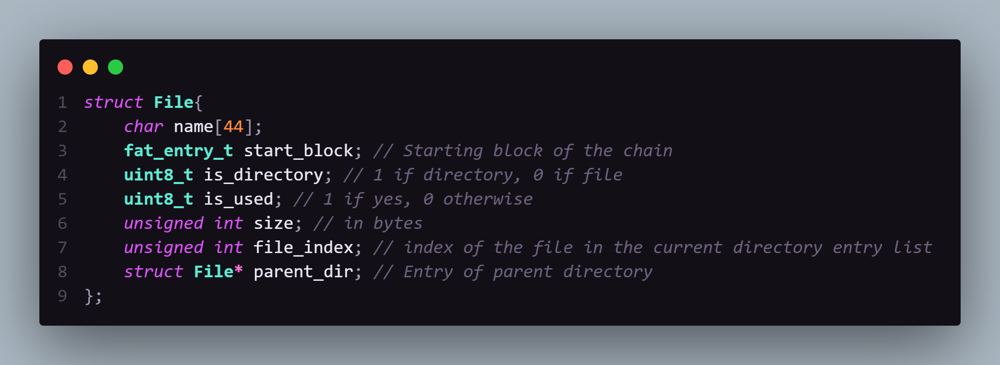
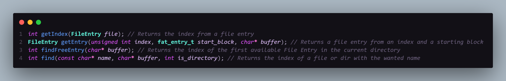
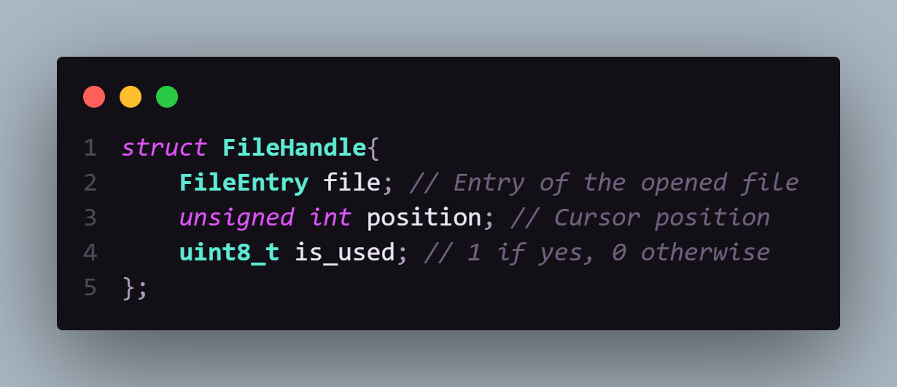
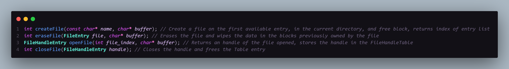
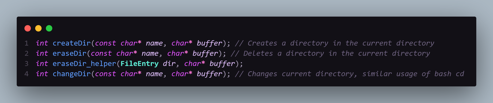
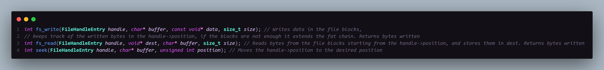

# FAT File System

## Author

Andrea Nardone
Matricola: 1987422

## Introduction

This is a project for the academic course Sistemi Operativi 2022/23 at Sapienza Università di Roma.  
This project written in C simulates a FAT file system by mapping a buffer in memory, and implementing all the necessary structures and data onto the buffer.  
The buffer is saved in `FileSystem.img` at the end of main, and reopened automatically at the next program call.

## FileSystem Layout

The file system is split in the following way:  

 

The size of the **FAT** segment depends on the `BLOCK_NUM` and `BLOCKS_SIZE`;  
They are currently set as respectively 16 and 512, as it is a manageable size for a demo, but they can be freely modified, obviously setting
them to a power of 2 and its multiples minimizes the wasted space.  
For the demo the **FAT** occupies 1 block.  
The Root directory Entry is in the first available block, with the next block as its starting block.  

## FAT

The **FAT** is an array of 2 bytes integers (shorts) renamed as `fat_entry_t`, with length of `BLOCK_NUM`.  
Each entry can assume any value from **0** to `BLOCK_NUM-1`, and three special values:  
- `FAT_FREE = -1`     Indicates a free block
- `FAT_EOC = -2`      Indicates an end of chain block
- `FAT_RSVD = -3`     Indicates a reserved block, such as the blocks for the FAT and the File Entries

The **FAT** is managed by the backbone functions:  

 

## File and Directory Entries

A file or a directory is stored in the buffer in the form of a struct called *File*

  

 

The size of the struct is 64 bytes, so for the demo, 8 File Entries are able to fit in a single block.

Every file entry has an index assigned, from 0 to **FILE_ENTRY_NUM**, since the entries are concurrent in memory every 64 Bytes, this makes it easier to identify and pass as arguments, with just a couple of helper functions

   
  
 

Both files and directories are stored the same way, in the `start_block` of its parent directory, only the flag `is_directory` differentiates a file and a dir.

#### Current limitation

The current implementation restricts file and dir entries for a directory to 8, exactly the number of Entries that fit in a block in the Demo.
Future updates will include the possibility of expanding the entries to multiple blocks, in order to have a truly dynamic system.

### File Handles

A file handle is a struct that contains the index of a file, and the cursor position in said file, as long as it is open.

  

 

When a file is opened, a file handle gets flagged as used and populated as needed, all file handles reside in the `FileHandleTable`, which is a static array of File Handles, of fixed size `MAX_OPENED_FILE` (arbitrary value of 4 for the demo)

### File Functions

  

### Directory Functions

  

### Data management

Once a file is opened, data functions are available to perform the most basic actions:

 

 

The *fs_write* function can extend the fat chain of a file to the next block available if the data is too large; similarly the *fs_read* function traverses the file's data across blocks if needed.
The functions support mainly char and strings type of data.

## Main

The main is based around a pseudo "infinite" loop that simulates an extremely simplified version of bash, its function is to test all the various structures and functions organically.  

To simulate bash, there is an *extern* variable called `current_directory` that keeps track of the directory we currently reside in;`current_directory` can hold any `FileEntry` as its value (Obviously the entry must be of a Directory and not a File).

## Usage

After running `make`, you can execute the main program by calling `./main`, by default debug options are disabled, to turn them on call `./main 1`, it enables a few prints in various functions.

Using the available commands let you test freely most of the functions:

    Available commands:
    -help: Lists all available commands
    -exit: Exits the program
    -test1: Runs a predetermined test, it uses a separate buffer from the main loop

    -createFile <name>: Creates a file
    -eraseFile <name>: Erases a file
    -listFile: Lists all files in the current path
    -openFile <name>: Opens a file

    -createDir <name>: Creates a directory
    -eraseDir <name>: Erases a directory
    -listDir: Lists all directories in the current path
    -changeDir <name>: Changes the current directory

    -printFAT: Prints the FAT
    -printFile <name>: Prints file information
    -printFileEntry: Prints all file entries
    -printFHT: Prints the file handle table

    File mode commands (after openFile):
    -write <text>: Writes text to the open file
    -read <size>: Reads bytes from the open file
    -seek <position>: Changes the file cursor position
    -closeFile: Closes the open file

